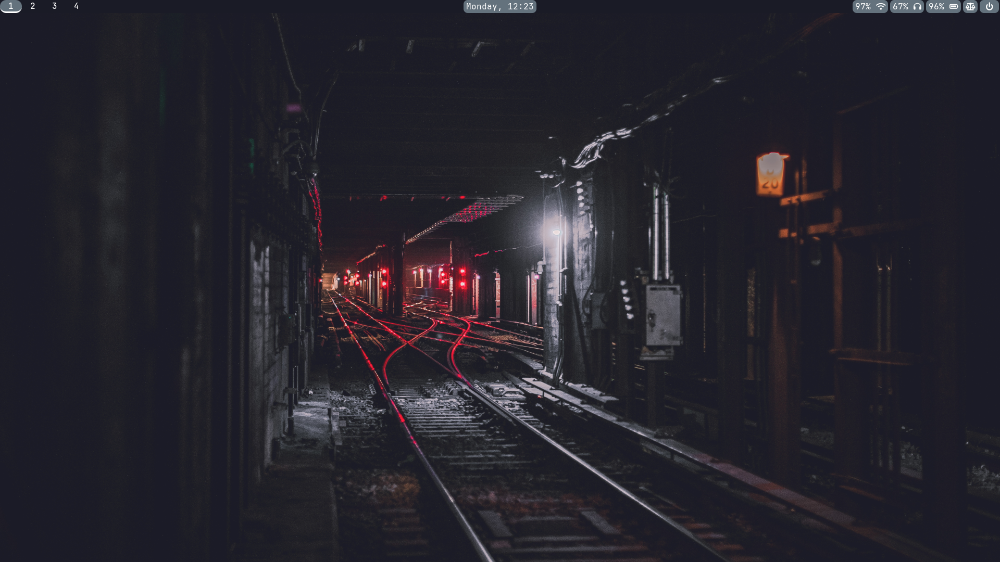
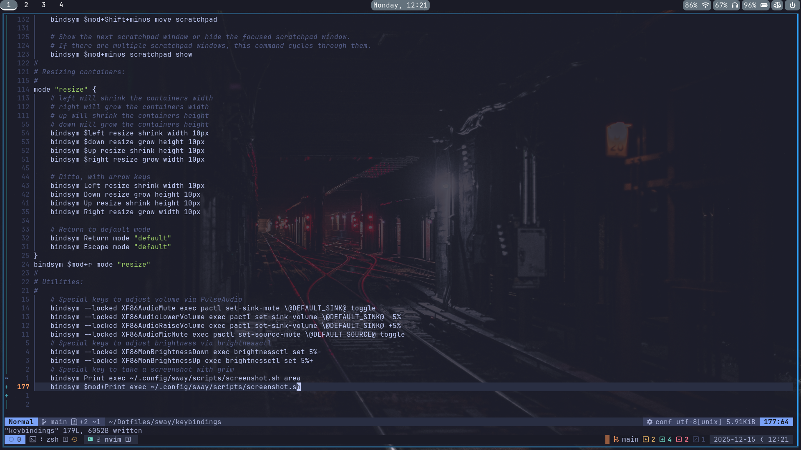

# My personal dotfiles

Hi! If you're seeing this, then you're checking out my dotfiles.

Below is the list of all the current software I use on my day-to-day basis on my system, along with a more detailed explanation on what components each software has.


## My current config list

- [Neovim](https://github.com/neovim/neovim)
- [ZSH (Z-Shell)](https://en.wikipedia.org/wiki/Z_shell)
- [tmux](https://github.com/tmux/tmux)
- [Ghostty](https://github.com/ghostty-org/ghostty)
- [Sway](https://github.com/swaywm/sway) (with Swaylock, Wofi, Wlogout and Waybar)

> [!NOTE] 
> This config is my personal setup and may include choices made for my own workflow. Copy and use at your own discretion. If you want a similar setup, consider customizing these configs for your own preferences!

## Screenshots

### Sway desktop


### Neovim (btw)


### Waybar


## Install guide
This repo will assume you use Arch Linux, in which case you should follow the below guide.

You can clone this repo:

HTTPS:
```bash
git clone https://github.com/KarloKomsic/repository ~/Dotfiles
cd Dotfiles/
```

SSH:
```bash
git clone git@github.com:username/repository.git ~/Dotfiles
cd Dotfiles/
```

To install the dotfiles and packages, head to the scripts/ directory:
```bash
cd scripts/
```
And then, run the install script:
```bash
./install.sh
```
